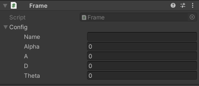
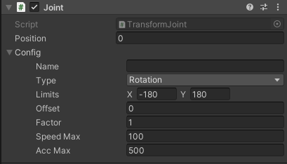
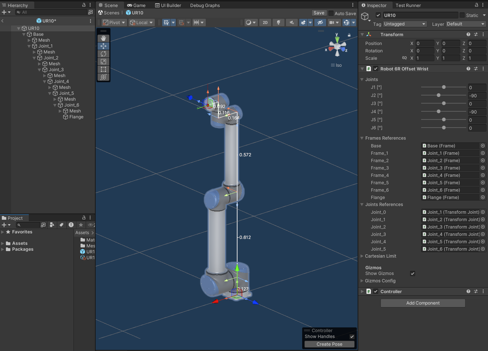

# Flange

# Overview
## What is Flange?
**Flange** is a Unity package for industrial robots simulation.

## Key Features:
+ Kinematic Solver: Analytical forward and inverse kinematic solvers for different robot types
+ Controller: The primary script for robot control, responsible for defining the robot's kinematics, tool configurations, and reference frames.

> [!NOTE]  
> This package does not include motion planning or trajectory generation functionality

# Installation
You can install the Flange package in Unity using one of the following methods:

### A. Install via Git URL (Recommended):
1. Open Unity > Package Manager
2. Click + → "Add package from git URL..."
3. Enter: `https://github.com/Preliy/Flange.git#upm`
4. Click Add and wait for installation.
   
### B. Install via git URL by adding this entry in the project's manifest.json:
   ```json
   "com.preliy.flange": "https://github.com/Preliy/Flange.git#upm"
   ```
# Contribution
Contributions are welcome! Developers can participate by reporting issues, suggesting features, or submitting pull requests. For support, refer to the documentation or join discussions in the project repository.

# Custom Support
For custom support or project-specific inquiries, contact us at `preliyex@gmail.com`.

# Sponsoring & Donations
If you find Flange useful, consider supporting the project to help maintain development and improve features:
+ [GitHub Sponsors](https://github.com/sponsors/Preliy)
+ [Buy Me a Coffee](buymeacoffee.com/preliy)

<br>

# Key Components
**Flange** is built on two primary components: `Frame.cs` and `Joint.cs`. These scripts define the kinematic chain and enforce movement constraints.

## Frame


`Frame.cs` defines a transformation matrix relative to its parent frame, setting local transformation values based on the parent’s coordinate system. 
This approach uses [Modified Denavit–Hartenberg (DH)](https://en.wikipedia.org/wiki/Denavit%E2%80%93Hartenberg_parameters) Parameters for consistent and efficient parameterization of joint positions and orientations within the robotic structure.

## Joint 



`Joint.cs` responsible for defining joint constraints and target position values relative to the frame. Each Joint must be paired with a Frame component on the same GameObject, enabling it to adhere to specified limits and target positions within the defined transformation matrix.

## Mechanical Unit


The `MechanicalUnit.cs` integrates multiple frames and joints into a single assembly, such as a robotic arm or an external positioner. It has key functions for configuring and controlling the unit, including:
+ **Custom Inspector:** A single joint value can be controlled using its corresponding slider field.
+ **Frame and Joint References:** All joints and frames must be assigned in sequential chain order.
+ **External Control:** Public methods to control the unit from another scripts.
+ **Save and Load Configurations:** Save and load configurations (Scriptable Object) for Frames and Joints, enabling the sharing of kinematic chain parameters across different prefabs.
+ **Kinematic Chain Visualization:** When Gizmos are enabled, a visual representation of the kinematic chain is displayed.

> [!NOTE]  
> Only serial (open chain) kinematic will supported by default

## Robots

`Robot.cs` serves as an abstract base class for various robotic manipulators within the Flange framework.
It defines abstract methods for forward (FK) and inverse kinematics (IK) that must be implemented by specific robot types.

+ **Kinematics Implementation**:
Forward and inverse kinematics calculations are defined in derived classes, allowing for flexibility in handling different robotic configurations.

* **Cartesian Limits**:
Defines workspace boundaries for the robot, ensuring that movements stay within safe and reachable zones. 
These limits are essential for _motion planning_ and _trajectory generation_, helping to guide and constrain robotic movements during operation.

### 6R Spherical Wrist
`Robot6RSphericalWrist.cs` represents a 6-axis serial manipulator with a conventional spherical wrist configuration.


You can find this Robot Prefab in Samples: `Assets/com.preliy.flange/Samples/Demo/Resources/ABB/ABB IRB 6700/ABB IRB 6700 235.prefab`

### 6R Offset Writs
`Robot6ROffsetWrist.cs` represents a 6-axis manipulator with an offset wrist design, similar to the configuration used by Universal Robots.



You can find this Robot Prefab in Samples: `Assets/com.preliy.flange/Samples/Demo/Resources/UR/UR10/UR10.prefab`

### 3D Delta
`Robot3DDelta.cs` represents a 3-axis delta manipulator that uses a parallel kinematics chain, calculated analytically without kinematic coupling. The flange position and the main three-axis positions are calculated first to determine the end effector’s precise location. The rotation of the support links is oriented using `LookAtRotation` quaternion calculations.


You can find this Robot Prefab in Samples: `Assets/com.preliy.flange/Samples/Demo/Resources/ABB/ABB IRB 360/ABB IRB 360 1 800 STD.prefab`

### Scara

`RobotScara.cs` represents a 4-axis SCARA (Selective Compliance Assembly Robot Arm) robot.


You can find this Robot Prefab in Samples: `Assets/com.preliy.flange/Samples/Demo/Resources/ABB/ABB IRB 910SC/ABB IRB 910SC.prefab`

## Controller

`Controller.cs` functions as the virtual robot controller within the Flange package, orchestrating calculations and configurations for robot motion and interaction.
+ **Kinematics Management**: Manages forward and inverse kinematics calculations, taking into account tool parameters, reference frames, and robot-specific configuration.
+ **External Unit Integration**: Includes external unit references and uses their position data for the Tool Center Point (TCP) calculations.


The `Controller.cs` component provides a custom inspector that allows to control the robot either by adjusting the joint values or by directly manipulating the TCP.  Additionally, the configuration selection tool includes a "Select" button, enabling users to browse all possible configurations for a specific pose, with the `Show Turn` option providing further configurations that account for axis turns.

To use the `Tool` and `Frame` properties, tools and frames must first be assigned in the corresponding lists within `Controller.cs`. The Tool and Frame property indices will reference these lists, allowing to select specific tools and frames based on their index values.

For kinematic configuration, `Controller.cs` includes three main fields:
+ The **Robot** field, where the robot itself is assigned.
+ The **Base** field, which requires the assignment of a base mechanical unit. This unit acts as the base for the robot, allowing the robot’s reference frame to be moved—for example, along a linear axis.
+ The **External** list, where external mechanical units, such as positioner or rotating table, can be added to extend the robot’s operational capabilities and coordinate its movements with additional devices.

> [!NOTE]
> If the mechanical configuration is modified, the inspector UI must be reloaded. Reselect the Controller GameObject to see the updated Joints Slider list in the inspector.

> [!NOTE] 
> To activate the TCP handle for manipulation within the Scene View, users must enable the Scene View Controller overlay.

> [!NOTE]  
> The latest asset version was uploaded and the demo scenes were built from Unity 2022.3.0f1 The advertised features relate to the latest version and might not be present in the earlier versions. Please check the documentation changelog.
